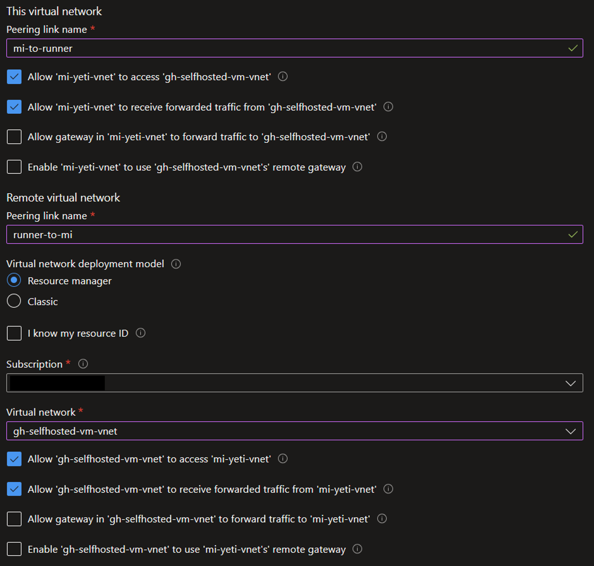
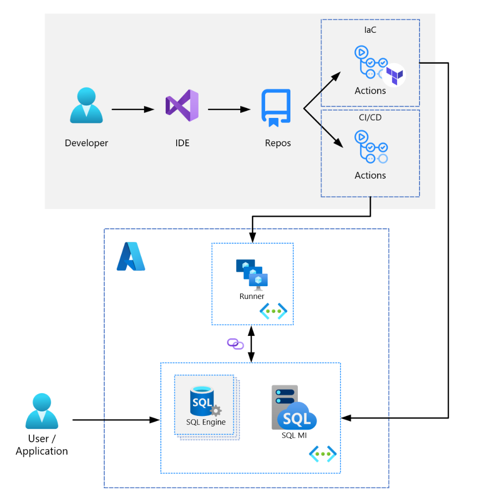

# azure-sql-mi-devops

---

| Page Type | Languages                    | Key Services                                       | Tools                         |
| --------- | ---------------------------- | -------------------------------------------------- | ----------------------------- |
| Sample    | SQL <br> HCL <br> PowerShell | Azure SQL Managed Instance <br> Azure VM (Windows) | Terraform <br> GitHub Actions |

---

# Deploying an Azure SQL Managed Instance with Terraform and GitHub Actions

This sample codebase demonstrates how to deploy an Azure SQL Managed Instance with Terraform and GitHub Actions.
<br>
The motivation behind this guide is the observed lack of readily available open-source codebase examples using these technologies together.
<br>
The scenario presented in this codebase is simple and contrived - it is not intended for production use, and should be viewed as a foundation for modification and expansion into more complex applications.

## Prerequisites

- [An Azure Subscription](https://azure.microsoft.com/en-us/free/) - for hosting cloud infrastructure
- [A GitHub Account](https://github.com/join) - for deploying code via GitHub Actions

## Running this sample

### _*Setting Up the Cloud Infrastructure and Repository*_

#### App Registration

- [Register a new application](https://learn.microsoft.com/en-us/azure/active-directory/develop/quickstart-register-app)
- [Create a new client secret](https://learn.microsoft.com/en-us/azure/active-directory/develop/quickstart-register-app#add-a-client-secret)

#### Note: Deploying with Bicep instead of Terraform

- While this guide focuses on using Terraform to deploy and manage the SQL MI infrastructure, you may swap out the Terraform components with a tool like Bicep. Bicep implementation details are not currently built into this codebase, but [this guide](https://learn.microsoft.com/en-us/azure/azure-sql/managed-instance/create-bicep-quickstart?view=azuresql&tabs=CLI) describes how to use Bicep to deploy the infrastructure.
- If using Bicep, you may skip the following sections:
  - Storage Account for Managing Remote Terraform State
  - Setting any of the variables starting with `TF_`
-  If using Bicep, you will need to update the following:
  - You may consider renaming the the `Terraform-Deploy` workflow
  - You will need to update the pipeline by removing the Terraform-specific commands and adding [Bicep-specific commands](https://learn.microsoft.com/en-us/azure/azure-resource-manager/bicep/deployment-script-bicep)

#### Storage Account for Managing Remote Terraform State

- [Azure Storage will be used for storing Terraform state](https://learn.microsoft.com/en-us/azure/developer/terraform/store-state-in-azure-storage?tabs=azure-cli). In the Azure Portal, create a common resource group, and then create a storage account within it ([doc](https://docs.microsoft.com/en-us/azure/storage/common/storage-account-create?tabs=azure-portal)).
- After the Storage Account is created, create a container within it to store the Terraform state files ([doc](https://docs.microsoft.com/en-us/azure/storage/blobs/storage-quickstart-blobs-portal#create-a-container)).

#### GitHub Actions Secrets & Variables

- To deploy to Azure using GitHub Actions, a handful of credentials are required for connection and configuration.

##### Secrets:

- The following credential is used to authenticate to Azure.

  1.  `AZURE_SP_CREDENTIALS`:

      - A JSON object that looks like the following will need to be populated with 4 values:

      ```
      {
      "clientId": "<GUID>",
      "clientSecret": "<STRING>",
      "subscriptionId": "<GUID>",
      "tenantId": "<GUID>"
      }
      ```

      - You can find more details on creating this secret [here](https://github.com/marketplace/actions/azure-login#configure-a-service-principal-with-a-secret).
      - For clientId, run: `az ad sp list --display-name <service principal name> --query '[].[appId][]' --out tsv`
      - For tenantId, run: `az ad sp show --id <clientID> --query 'appOwnerOrganizationId' --out tsv`
      - For subscriptionId, run: `az account show --query id --output tsv`
      - For clientSecret: This is the client secret created alongside the App Registration above

- The following credentials are used to set up the Azure SQL Managed Instance.

  2.  `SQL_ADMIN_USER` - Username you want to use for the SQL Server
  3.  `SQL_ADMIN_PASSWORD` - Password you want to use for the SQL Server. Note that the password must be at least 16 characters in length and contain uppercase, lowercase, numeric, and non-numeric characters, and it cannot contain part of the admin username.

      Note: All other SQL MI variables are defined in `infra/terraform/modules/module-azure-sql-mi/variables.tf`

##### Variables:

- The following credentials are used to authenticate with the storage account that stores the remote Terraform state.

  1.  `TF_REGION` - Region of the Storage Account for managing Terraform state
  2.  `TF_RESOURCE_GROUP` - Name of the resource group containing the Storage Account
  3.  `TF_STORAGE_ACCOUNT` - Name of the Storage Account for managing Terraform state
  4.  `TF_CONTAINER_NAME` - Name of the Storage Account container for managing Terraform state
  5.  `RESOURCE_NAME_ROOT` - The root name of the resources to be created. The resources provisioned will have a suffix and prefix appended to this name.
  6.  `SQL_INITIAL_CATALOG` - Name of the database to be created on the SQL Managed Instance

#### GitHub Self-Hosted Runner

- A self-hosted runner is required because the runner must be integrated with the same virtual network as the SQL Managed Instance - you cannot deploy directly to a SQL Managed Instance from a GitHub-hosted runner.
- The self-hosted runner is required to run the `SQL-MI-CICD` GitHub Actions workflow. The runner can be hosted on a VM or container. For the purposes of this sample codebase, I have set up a self-hosted Windows VM runner by following the steps [here](https://docs.github.com/en/actions/hosting-your-own-runners/managing-self-hosted-runners/adding-self-hosted-runners). This guide assumes that you are using a Windows VM runner. You may use more sophisticated infrastructure for your setup.

  - You should consider configuring the self-hosted runner application as a service to automatically start the runner application when the machine starts, which can be done by following the steps [here](https://docs.github.com/en/actions/hosting-your-own-runners/managing-self-hosted-runners/configuring-the-self-hosted-runner-application-as-a-service?platform=windows).
  - On the self-hosted runner, you will need to set up the following tools:

    - [.NET 6.0](https://dotnet.microsoft.com/en-us/download/dotnet/6.0)
      - Add `dotnet` as a path variable
    - Add Nuget source to install SqlPackage: `dotnet nuget add source https://api.nuget.org/v3/index.json -n nuget.org`
    - [SqlPackage (dotnet package)](https://learn.microsoft.com/en-us/sql/tools/sqlpackage/sqlpackage-download?view=sql-server-ver16#installation-cross-platform): `dotnet tool install -g microsoft.sqlpackage`
    - [Azure CLI](https://docs.microsoft.com/en-us/cli/azure/install-azure-cli-windows?tabs=azure-cli)
    - [PowerShell](https://learn.microsoft.com/en-us/powershell/scripting/install/installing-powershell-on-windows?view=powershell-7.3#installing-the-msi-package)

  - For testing, you may consider installing additional tools on the self-hosted runner like [Git](https://git-scm.com/downloads) and [Azure Data Studio](https://docs.microsoft.com/en-us/sql/azure-data-studio/download-azure-data-studio?view=sql-server-ver15).

- If you don't have the runner set to [run at startup](https://docs.github.com/en/actions/hosting-your-own-runners/managing-self-hosted-runners/configuring-the-self-hosted-runner-application-as-a-service?platform=windows), you may run the self-hosted runner on the VM by navigating to the directory containing the runner service and starting it. For example:
  ```
  cd actions-runner
  .\run.cmd
  ```

### _*Deploying the Cloud Infrastructure*_

#### Deploying the SQL Managed Instance

- Deploy the SQL Managed Instance with Terraform by running the `Terraform-Deploy` GitHub Action. This action will take up to 30 minutes to run. This will create a Managed Instance server and database.

#### Connecting the Self-Hosted Runner to the SQL Managed Instance

- Once the SQL Managed Instance is deployed, you need to enable it to communicate with the self-hosted runner. You may do this either by...

  - Creating your runner in the newly created SQL MI virtual network, or
  - By peering the SQL MI virtual network with an existing virtual network containing a self-hosted runner (this is recommended as it separates the concerns between the MI network and runner network). This was the approach followed in setting up this guide.
    - To peer the virtual networks, follow the steps [here](https://docs.microsoft.com/en-us/azure/virtual-network/tutorial-connect-virtual-networks-portal) (Since both networks may already exist, you may begin at [this step](https://learn.microsoft.com/en-us/azure/virtual-network/tutorial-connect-virtual-networks-portal#create-virtual-network-peer), and you may skip the 'Create virtual machines' step). _The address space of your SQL MI may not overlap with the address space of your self-hosted runner's network_.

  Your peering may look something like this:
  

#### Verifying the Connection

- From the self-hosted runner VM, you can verify the connectivity over the peering/network link by running the following PowerShell command: `Test-NetConnection -computer <sql-mi-host> -port 1433`.
- A script that can be run locally on the runner to test the connection and build/deploy/debug steps prior to running the GitHub Action is in `etc/runner-build-test.ps1`.

#### Running the CI/CD Action

- After the virtual networks are peered/linked and tested, you may run the `SQL-MI-CICD` GitHub Action to deploy the SQL Project into the sample database in the SQL Managed Instance server.
- The SQL Project in this codebase deploys a simple table. You may modify the SQL Project to deploy your own schema and data.

## Architecture & Workflow



## Potential Use Cases

- There are many use cases for Azure SQL Managed Instance; for example, you should consider using SQL Managed Instance when you need near 100% compatibility with the latest SQL Server database engine, want to lift and shift your applications to Azure Arc data services with minimal application and database changes, and maintain data sovereignty.

## Additional Resources

- [Azure SQLPackage GitHub Action](https://github.com/Azure/run-sqlpackage-action)
- [Spreading your SQL Server wings with Azure SQL Managed Instances - blog](https://www.kevinrchant.com/2023/05/06/spreading-your-sql-server-wings-with-azure-sql-managed-instances/)
- [Troubleshooting connection issues - blog](https://www.techbrothersit.com/2021/09/connection-was-denied-since-deny-public.html?m=1)
